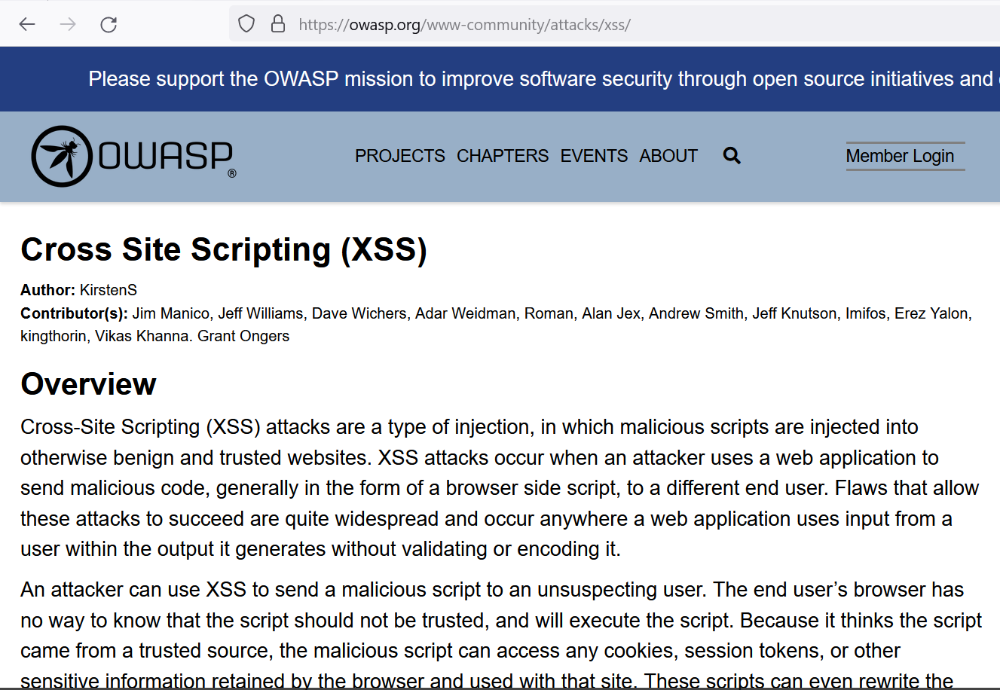

# Crazy Calculatorz Vulnerability Report

The goal specific goal of this step is to produce a technical writeup that explains the vulnerability, provides steps to replicate the vulnerability, and a Selenium script that provides the existence of the vulnerability.

## Introduction
Crazy Calculatorz is a place for calculation enthusiasts to go to share their love of calculating. Aside from the inherent file system exposure through the PUT and DELETE methods, there are two main vulnerabilities present in Crazy Calculatorz: Cross-Site Scripting and PHP injection.

### Cross-Site Scripting

#### What is Cross-Site Scripting (XSS)?
Cross-Site Scripting (XSS) is a web security vulnerability where an attacker injects malicious scripts (often JavaScript) into web pages viewed by others. These scripts execute in the victims browser and can be used to perform a wide range of damaging actions from identity theft to malware infection. XSS has the ability compromise the confidentiality (stealing session cookies/credentials), integrity (using the app to spread malware/perform malicious actions on behalf of users), and availability (overwhelming a server/browser). The most common types of XSS are reflected and stored. These vulnerabilities arise due to lack of proper input and output validation/sanitization of user generated data.

Reflected XSS is when an attacker tricks a victim into making a malicious request without their knowledge. This often occurs through a specially crafted link or URL. In this scenario, the injected script is "reflected" off a web server and executed in the victim's browser when they click the link or visit the compromised URL. 

Stored XSS involves an attacker injecting malicious scripts directly into a website's database or storage. These scripts are then served to other users when they access the affected web page. Stored XSS attacks can have long-lasting effects, as the injected script remains on the server until it's removed.

#### Steps to Replicate
The XSS vulnerability is present in the "Enter Name" text input on the "calculator.html" page. User-generated input is directly displayed on the page without any form of sanitization or validation. As a result, attackers can inject JavaScript code within HTML script tags, which the server will then send back to be executed in the victim's browser.

SHOW VULNERABLE SNIPPET HERE

Replicating this vulnerability is fairly straightforward. To do so, follow the steps below:

1. Submit malicious input into the "visitor_name" field.

2. After filling out the rest of the form and clicking the "Calculate" button, the Javascript executes.

#### Selenium Script

### PHP Injection

#### What is PHP Injection?
PHP Injection is a type of web vulnerability where an attacker can manipulate PHP code execution on a server by injecting malicious code snippets. This occurs when user inputs or untrusted data are incorporated into PHP code without proper validation or sanitization. PHP Injection is a critical vulnerability as it can allow attackers to gain control of the server and execute commands remotely. PHP and in turn RCE is such a severe vulnerability because of how much control it allows the attacker to have. They can easily violate each aspect of the CIA triad. Because the attacker can remotely access the shell, the possibilities for damage are extreme. Viewing sensitive information, corrupting/altering data, and shutting down critical services are just a few actions that an attacker could perform.

#### Steps to Replicate
The fields "number1" and number2" are vulnerable to PHP injection due to lack input validation and sanitization. As seen below, user input is directly incorporated into the eval function as part of the calculation. By crafting a special payload, attackers can inject php code that will be executed and the result will be sent back to the attacker.

'''php
<?php
// Set a custom error handler
set_error_handler(function($severity, $message, $file, $line) {
    throw new ErrorException($message, 0, $severity, $file, $line);
});

register_shutdown_function(function(){
    $error = error_get_last();
    if ($error !== NULL) {
        echo '<h1>500 Error: Internal Server Error</h1>';
    }
});

$result = null;
$visitor_name = null;

if ($_SERVER['REQUEST_METHOD'] === 'POST') {
    if (isset($_POST['visitor_name'], $_POST['number1'], $_POST['operation'], $_POST['number2'])) {
        $visitor_name = $_POST['visitor_name'];
        $number1 = $_POST['number1'];
        $operation = $_POST['operation'];
        $number2 = $_POST['number2'];

        // calc string
        $calculation = $number1 . ' ' . $operation . ' ' . $number2;
        // Handle eval in a try-catch block
        try {
            eval("\$result = $calculation;");
        } catch (Throwable $e) { // Catch any errors or exceptions
            echo '<h1>500 Error: Internal Server Error</h1>';
            exit; // Stop script execution after an error
        }
    } else {
        echo '<h1>500 Error: Invalid Input</h1>';
        exit; // Stop script execution if input is invalid
    }
} else {
    echo '<h1>500 Error: Please use the form to submit a calculation.</h1>';
    exit; // Stop script execution if the method is not POST
}
?>

<h1>Welcome <?php echo $visitor_name; ?></h1>
<h2>Thanks for calculating with us! Your results can be found below. Please come again!</h2>

Result: <?php echo $result; ?>

'''

#### Selenium Script